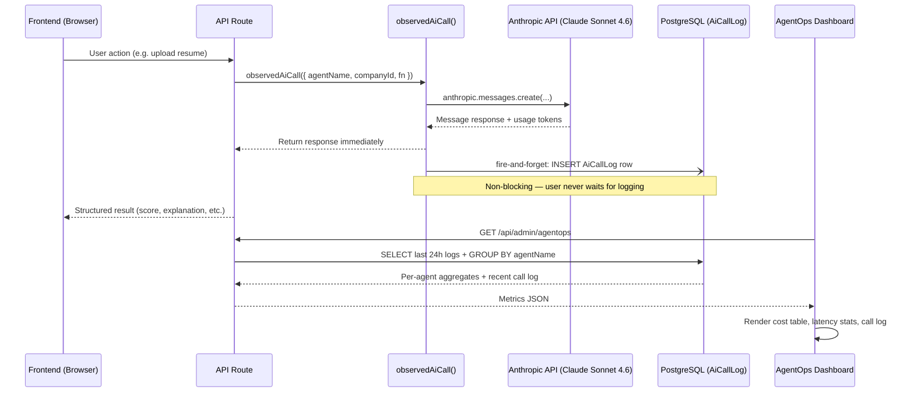
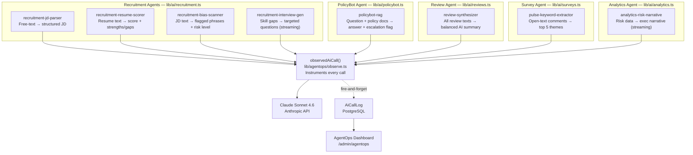
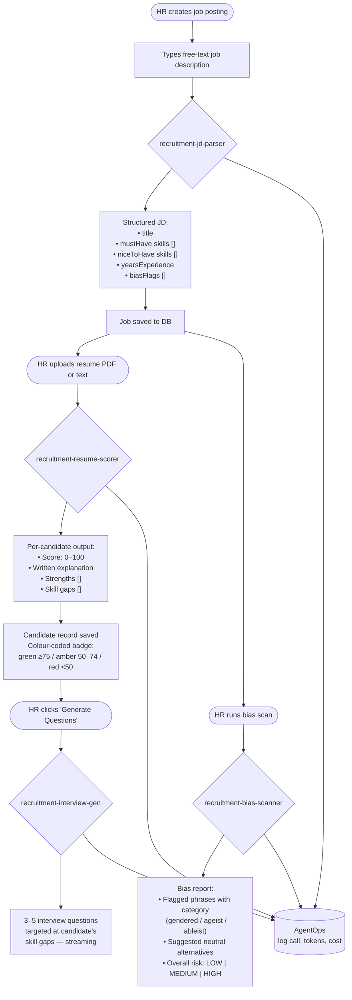
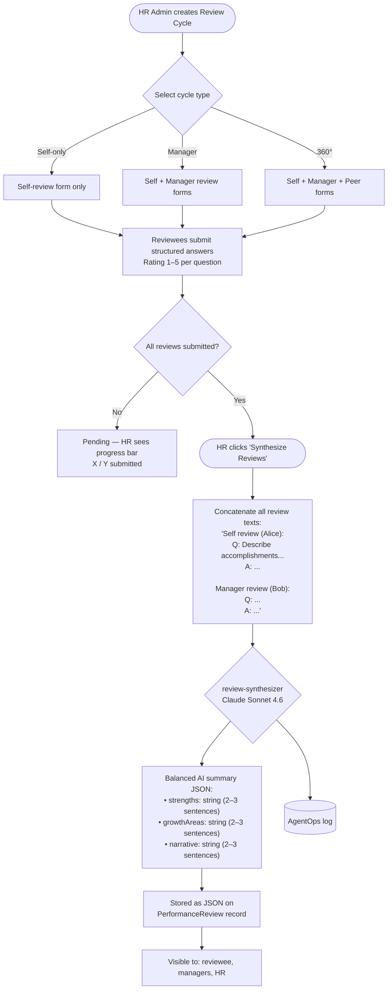
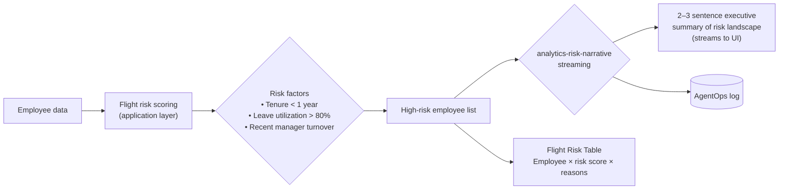
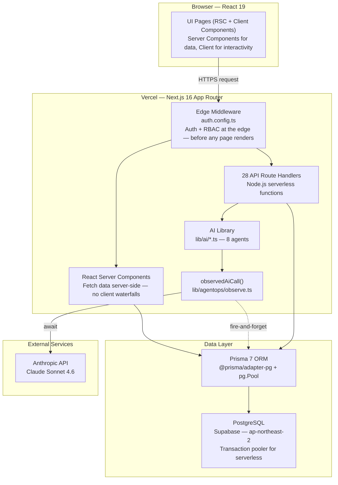
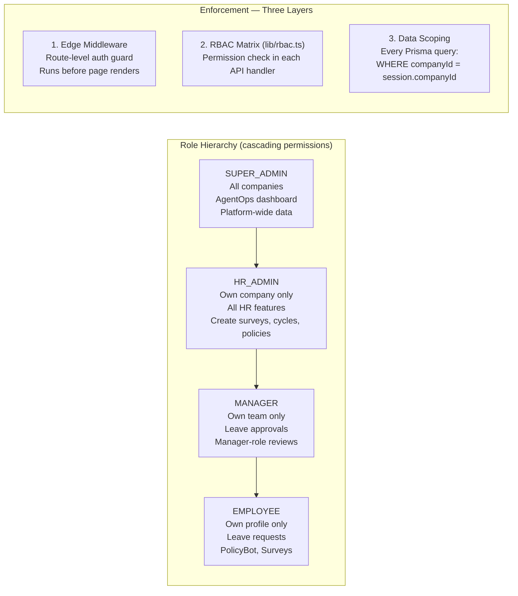
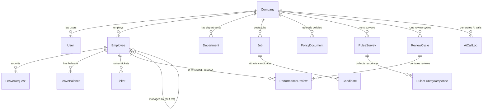

# HireFlow

> **AI-native Human Resource Management System** — recruitment, leave, policy Q&A, pulse surveys, performance reviews, and real-time AI observability — all powered by Claude Sonnet 4.6.

**Live Demo:** [hireflow-black.vercel.app](https://hireflow-black.vercel.app)

---

## Table of Contents

1. [What is HireFlow?](#what-is-hireflow)
2. [AgentOps — AI Observability Layer](#agentops--ai-observability-layer)
3. [AI Agent Architecture](#ai-agent-architecture)
4. [Feature Walkthrough](#feature-walkthrough)
5. [System Architecture](#system-architecture)
6. [Tech Stack](#tech-stack)
7. [Database Schema](#database-schema)
8. [API Reference](#api-reference)
9. [Project Structure](#project-structure)
10. [Local Development](#local-development)
11. [Deployment](#deployment)
12. [Demo Accounts](#demo-accounts)

---

## What is HireFlow?

HireFlow is a **production-grade, multi-tenant HRMS** where every feature is enhanced by Claude AI — not bolted on as an afterthought, but woven into the core data flows. It covers the full employee lifecycle:

| Module | What it does | Where AI fits in |
|--------|-------------|-----------------|
| **Recruitment** | Post jobs, score resumes, manage pipeline | JD parsing, resume scoring 0–100, bias scanning, interview Q generation |
| **Leave Management** | Submit, approve, and track leave | — |
| **PolicyBot** | Employees ask HR questions in plain English | RAG over uploaded policy PDFs with auto-escalation |
| **Pulse Surveys** | Anonymous recurring surveys with analytics | Keyword theme extraction from open-text answers |
| **Performance Reviews** | 360° review cycles with structured questions | Multi-reviewer synthesis into balanced AI summaries |
| **Analytics** | Funnel charts, headcount breakdowns, flight risk | Claude-generated executive narrative on at-risk employees |
| **AgentOps** | Real-time AI call monitoring dashboard | Every Claude call logged: latency, tokens, cost, errors |

---

## AgentOps — AI Observability Layer

AgentOps is the **observability backbone** of HireFlow. Every single Claude API call — across all 8 agents — is automatically instrumented without manual annotation at each call site. This gives the Super Admin a live window into AI cost, performance, and reliability in real time.

### The Core Insight

Most AI integrations treat observability as a retrofit. HireFlow treats it as the contract: **no agent ships without going through `observedAiCall()`**. This means the cost and latency of every AI feature are measurable from the first request, enabling data-driven decisions about which agents are worth their inference cost.

### How It Works

```
┌─────────────────────────────────────────────────────────────────┐
│                       observedAiCall()                          │
│                    lib/agentops/observe.ts                      │
│                                                                 │
│  1.  Record start = Date.now()                                  │
│  2.  Execute fn()  ──►  anthropic.messages.create(...)          │
│  3.  Extract response.usage.input_tokens + output_tokens        │
│  4.  Compute costUsd = (inputTokens×$3 + outputTokens×$15)      │
│                         ÷ 1,000,000                             │
│  5.  Compute latencyMs = Date.now() - start                     │
│  6.  Fire-and-forget ──► INSERT INTO AiCallLog  (non-blocking)  │
│  7.  Return original response to caller unchanged               │
└─────────────────────────────────────────────────────────────────┘
```

The fire-and-forget pattern is intentional: the DB write is never awaited, so it **never adds to user-perceived latency**. Failed writes are caught and swallowed — observability cannot break a user-facing feature.

### The `observedAiCall` Wrapper — Full Source

```typescript
// lib/agentops/observe.ts
export async function observedAiCall<T>({
  agentName,    // "recruitment-resume-scorer", "policybot-rag", etc.
  companyId,    // for per-tenant cost attribution
  fn,           // () => anthropic.messages.create(...)
}: ObservedCallOptions<T>): Promise<T> {
  const start = Date.now()

  try {
    const response = await fn()
    const latencyMs = Date.now() - start

    const { input_tokens, output_tokens } = (response as any).usage ?? {}
    const inputTokens = input_tokens ?? 0
    const outputTokens = output_tokens ?? 0

    // Claude Sonnet 4.6 pricing: $3/M input, $15/M output
    const costUsd = (inputTokens * 3 + outputTokens * 15) / 1_000_000

    // Summarize response for log (first 500 chars or tool name)
    let responseSummary = ""
    const content = (response as any)?.content
    if (Array.isArray(content)) {
      const textBlock = content.find((b: any) => b.type === "text")
      responseSummary = textBlock?.text?.slice(0, 500) ?? ""
      if (!responseSummary) {
        const toolBlock = content.find((b: any) => b.type === "tool_use")
        if (toolBlock) responseSummary = `[tool_use: ${toolBlock.name}]`
      }
    }

    // Non-blocking DB write — user never waits for this
    prisma.aiCallLog.create({
      data: { agentName, prompt: agentName, response: responseSummary,
              inputTokens, outputTokens, latencyMs, costUsd,
              companyId: companyId ?? null }
    }).catch(console.error)

    return response
  } catch (error: any) {
    // Log failures too — critical for debugging production issues
    prisma.aiCallLog.create({
      data: { agentName, prompt: agentName,
              response: `ERROR: ${error?.message ?? "unknown"}`,
              inputTokens: 0, outputTokens: 0,
              latencyMs: Date.now() - start, costUsd: 0,
              companyId: companyId ?? null }
    }).catch(console.error)
    throw error
  }
}
```

### AgentOps Data Flow



### AgentOps Dashboard (Super Admin)

The dashboard at `/admin/agentops` is visible only to the `SUPER_ADMIN` role and displays:

```
┌──────────────────────────────────────────────────────────────────────┐
│                        AgentOps Dashboard                            │
│                                                                      │
│   ┌──────────────┐   ┌──────────────┐   ┌──────────────┐            │
│   │ Total Calls  │   │  Total Cost  │   │  Avg Latency │            │
│   │    1,284     │   │  $0.42 USD   │   │    847 ms    │            │
│   └──────────────┘   └──────────────┘   └──────────────┘            │
│                                                                      │
│   Per-Agent Breakdown (last 24 hours)                                │
│   ┌──────────────────────────────────┬───────┬─────────┬─────────┐  │
│   │ Agent                            │ Calls │ Avg(ms) │   Cost  │  │
│   ├──────────────────────────────────┼───────┼─────────┼─────────┤  │
│   │ recruitment-resume-scorer        │   412 │   923ms │  $0.18  │  │
│   │ policybot-rag                    │   318 │   654ms │  $0.09  │  │
│   │ recruitment-jd-parser            │   201 │   441ms │  $0.06  │  │
│   │ recruitment-bias-scanner         │   156 │   388ms │  $0.04  │  │
│   │ review-synthesizer               │    89 │  1204ms │  $0.03  │  │
│   │ pulse-keyword-extractor          │    64 │   512ms │  $0.01  │  │
│   │ recruitment-interview-gen        │    32 │   789ms │  $0.01  │  │
│   │ analytics-risk-narrative         │    12 │   634ms │  $0.00  │  │
│   └──────────────────────────────────┴───────┴─────────┴─────────┘  │
│                                                                      │
│   Recent AI Calls                                                    │
│   ┌────────────────────────────────────────────────────────────────┐ │
│   │ 14:32:01 │ resume-scorer  │ 847 tokens │ 12ms │ $0.0001 │ OK  │ │
│   │ 14:31:44 │ policybot-rag  │ 2,103 tok  │ 8ms  │ $0.0004 │ OK  │ │
│   │ 14:29:12 │ jd-parser      │ 612 tokens │ 6ms  │ $0.0001 │ OK  │ │
│   └────────────────────────────────────────────────────────────────┘ │
└──────────────────────────────────────────────────────────────────────┘
```

**What the dashboard surfaces:**

| Metric | What it tells you |
|--------|------------------|
| **Total calls** | Overall AI usage volume across all features |
| **Total cost (USD)** | Exact spend based on token pricing |
| **Average latency** | P50 response time per agent — detect API degradation |
| **Task completion rate** | Resolved tickets ÷ total tickets — real-world agent success |
| **Error highlighting** | Failed calls shown in red with error message |
| **Response preview** | First 500 chars of each Claude response in the log |
| **Per-company breakdown** | `companyId` on each log row enables tenant-level cost attribution |

---

## AI Agent Architecture

HireFlow has **8 specialized AI agents**, each scoped to a single responsibility and all instrumented through AgentOps.

### Agent Inventory

| Agent | Trigger | Input | Output | Pattern |
|-------|---------|-------|--------|---------|
| `recruitment-jd-parser` | Job post creation | Free-text job description | `{title, mustHave[], niceToHave[], yearsExp, biasFlags[]}` | Tool use → JSON |
| `recruitment-resume-scorer` | Resume upload | Resume text + job requirements | `{score: 0–100, explanation, strengths[], gaps[]}` | Tool use → JSON |
| `recruitment-bias-scanner` | Manual trigger / job save | Job description | `{flags[{phrase, type, suggestion}], overallRisk: LOW\|MEDIUM\|HIGH}` | Tool use → JSON |
| `recruitment-interview-gen` | Candidate detail page | Candidate skill gaps + job title | 3–5 tailored questions | Streaming text |
| `policybot-rag` | Employee question submit | Question + top-3 policy docs | `{answer, sources[], confidence, shouldEscalate, escalationReason?}` | Tool use + prompt cache |
| `review-synthesizer` | HR triggers synthesis | All submitted review texts | `{strengths, growthAreas, narrative}` | JSON prompt |
| `pulse-keyword-extractor` | Survey results page | Array of open-text comments | Top 5 themes with frequency counts | Tool use → JSON |
| `analytics-risk-narrative` | Analytics page load | High-risk employee list | 2–3 sentence executive summary | Streaming text |

### Agent Map



### Interaction Patterns

Each agent uses one of three Claude interaction patterns:

#### Pattern 1 — Tool Use (Structured JSON)

Used by: `jd-parser`, `resume-scorer`, `bias-scanner`, `policybot-rag`, `keyword-extractor`

Forces Claude to return valid, typed JSON every time by declaring a tool schema and setting `tool_choice: { type: "tool", name: "..." }`. Eliminates parsing fragility — the output is always well-formed.

```typescript
const response = await anthropic.messages.create({
  model: "claude-sonnet-4-6",
  tools: [{
    name: "score_resume",
    input_schema: {
      type: "object",
      properties: {
        score:       { type: "number" },
        explanation: { type: "string" },
        strengths:   { type: "array", items: { type: "string" } },
        gaps:        { type: "array", items: { type: "string" } },
      },
      required: ["score", "explanation", "strengths", "gaps"]
    }
  }],
  tool_choice: { type: "tool", name: "score_resume" }, // force exactly this tool
  messages: [{ role: "user", content: resumeText }]
})
// Perfectly typed output — no JSON.parse(), no try/catch on structure
const result = response.content[0].input
```

#### Pattern 2 — Streaming Text

Used by: `interview-gen`, `analytics-risk-narrative`

For conversational or narrative outputs where progressive rendering improves UX. The user sees text appear word-by-word rather than waiting for the full response.

#### Pattern 3 — JSON Prompt

Used by: `review-synthesizer`

The system prompt instructs Claude to return a specific JSON structure; response is parsed with `JSON.parse()`. Used for simple, stable schemas where the overhead of a full tool declaration isn't warranted.

### Prompt Caching

Applied to stable, high-reuse content blocks to reduce cost by ~90% on repeated calls within the 5-minute ephemeral cache TTL:

| Agent | Cached content |
|-------|---------------|
| `policybot-rag` | System message + all policy document context blocks |
| `review-synthesizer` | System message |
| All recruitment agents | System message (HR role prompt) |

```typescript
// Mark stable blocks for caching — charged at 10% of normal input price on cache hit
{ role: "user", content: [
  { type: "text", text: systemPrompt,
    cache_control: { type: "ephemeral" } },   // ← cached (stable)
  { type: "text", text: policyDocContext,
    cache_control: { type: "ephemeral" } },   // ← cached (stable for 5 min)
  { type: "text", text: employeeQuestion },   // ← not cached (changes every call)
]}
```

---

## Feature Walkthrough

### Recruitment Pipeline — End-to-End AI Flow



**Kanban Pipeline**

Candidates move through six stages via drag-and-drop:

```
Applied → Screened → Interview → Offer → Hired
                                       → Rejected
```

Each stage transition is persisted immediately via `PUT /api/recruitment/candidates/[id]`.

---

### PolicyBot — RAG Flow

```mermaid
flowchart TD
    A([Employee types HR question]) --> B[Fetch all company PolicyDocuments\nfrom PostgreSQL]
    B --> C["Keyword relevance scoring\n(stop-word filtered tokenization)\nScore each doc against question terms"]
    C --> D["Select top 3 most relevant docs\nTrim each to 2,000 chars"]
    D --> E["Build context string:\n'[Policy: Leave Policy]\n...content...\n[Policy: Code of Conduct]\n...content...'"]
    E --> F["Apply prompt caching\nSystem message + context blocks\n(ephemeral, 5-min TTL — ~90% cost reduction on repeats)"]
    F --> G{policybot-rag\nClaude Sonnet 4.6}
    G --> H["Structured output:\n• answer: string\n• sources: string[]\n• confidence: LOW|MEDIUM|HIGH\n• shouldEscalate: boolean\n• escalationReason?: string"]
    H --> I{shouldEscalate?}
    I -- No --> J[Return answer + sources to employee]
    I -- Yes --> K[Create Ticket record in DB\n(sensitive / disciplinary / legal query)]
    K --> L[HR reviews ticket queue\nat /policybot]
    G --> M[("AgentOps log")]
```

---

### Performance Review Synthesis Flow



---

### Analytics & Flight Risk



Additional analytics panels:
- **Hiring funnel** — candidate stage conversion rates (Recharts bar chart)
- **Headcount** — department breakdown and gender distribution (donut chart)
- **Leave utilization** — leave type usage over rolling periods

---

## System Architecture



### Multi-Tenancy Model



---

## Tech Stack

| Layer | Technology | Version | Notes |
|-------|-----------|---------|-------|
| Framework | Next.js (App Router, Turbopack) | 16.2.4 | RSC + streaming + Edge middleware |
| Language | TypeScript | 5.9.3 | `strict: true`, path alias `@/*` |
| Styling | Tailwind CSS 4 + shadcn/ui | 4.0 / 4.4.0 | Utility-first + accessible component primitives |
| Auth | NextAuth 5 | 5.0.0-beta.31 | JWT-based, email credentials, edge-compatible |
| ORM | Prisma 7 + `@prisma/adapter-pg` | 7.8.0 | Native `pg.Pool` — safe for Vercel serverless |
| Database | PostgreSQL (Supabase) | — | Transaction pooler (port 6543) for production |
| AI Model | Claude Sonnet 4.6 | `claude-sonnet-4-6` | Tool use, streaming, ephemeral prompt caching |
| AI SDK | `@anthropic-ai/sdk` | 0.91.0 | Full API surface including tool use + streaming |
| Charts | Recharts | 3.8.1 | Funnel, donut, and bar charts |
| PDF Parsing | pdf-parse | 2.4.5 | Resume and policy document ingestion |
| UI Primitives | Base UI | 1.4.1 | Headless accessible components |
| Icons | Lucide React | 1.11.0 | Consistent icon set throughout |
| Toast | Sonner | 2.0.7 | Non-blocking in-app notifications |
| Deployment | Vercel | — | Edge Network + Serverless Functions |

---

## Database Schema

HireFlow has **16 Prisma models** organized around four concerns:



### Key Model Details

**`AiCallLog`** — the AgentOps observability table:

```prisma
model AiCallLog {
  id           String   @id @default(cuid())
  agentName    String   // "recruitment-resume-scorer", "policybot-rag", etc.
  prompt       String   // agent name as prompt summary
  response     String   // first 500 chars of Claude response (or error message)
  inputTokens  Int
  outputTokens Int
  latencyMs    Int
  costUsd      Float    // (inputTokens × 3 + outputTokens × 15) / 1,000,000
  companyId    String?  // nullable — enables per-tenant cost breakdown
  createdAt    DateTime @default(now())
}
```

**`Employee`** — central entity linking all HR features:

```prisma
model Employee {
  id          String    @id @default(cuid())
  name        String
  title       String
  department  String
  skills      Json      // string[] of skill tags
  managerId   String?   // self-referential FK for org chart
  hireDate    DateTime
  status      String    // "ACTIVE" | "INACTIVE"
  gender      String
  companyId   String
}
```

**Key design decisions across all models:**
- All primary keys are CUIDs (collision-resistant, URL-safe)
- JSON fields stored as `Json` type, parsed in application code
- No hard deletes — status fields used instead (`ACTIVE/INACTIVE`, `OPEN/CLOSED`)
- `AiCallLog.companyId` is nullable since some calls (e.g. auth flows) have no tenant context

---

## API Reference

All endpoints require a valid session. Role requirements are enforced per route.

### Employees
```
GET  /api/employees              List company employees (HR_ADMIN+)
POST /api/employees              Create employee (HR_ADMIN)
GET  /api/employees/[id]         Employee detail (role-scoped)
PUT  /api/employees/[id]         Update employee (HR_ADMIN)
```

### Recruitment
```
GET  /api/recruitment/jobs                     List jobs (HR_ADMIN+)
POST /api/recruitment/jobs                     Create job → JD parser runs
GET  /api/recruitment/jobs/[id]                Job + candidates
PUT  /api/recruitment/jobs/[id]                Update job
GET  /api/recruitment/candidates               All candidates (HR_ADMIN+)
POST /api/recruitment/candidates/upload        Upload resume → scorer runs
PUT  /api/recruitment/candidates/[id]          Update pipeline stage
GET  /api/recruitment/bias                     Bias scan for a JD
```

### Leave
```
GET  /api/leave/requests            Requests (role-scoped)
POST /api/leave/requests            Submit request (EMPLOYEE+)
PUT  /api/leave/requests/[id]       Approve / reject (MANAGER+)
GET  /api/leave/balance             Own leave balances (EMPLOYEE+)
```

### PolicyBot
```
POST /api/policybot/chat            Submit question → RAG answer
POST /api/policybot/upload          Upload policy PDF (HR_ADMIN)
GET  /api/policybot/tickets         Escalation ticket list (HR_ADMIN)
PUT  /api/policybot/tickets/[id]    Resolve ticket (HR_ADMIN)
```

### Surveys
```
GET  /api/surveys                   List surveys (company-scoped)
POST /api/surveys                   Create survey (HR_ADMIN)
POST /api/surveys/[id]/respond      Submit anonymous response (EMPLOYEE+)
GET  /api/surveys/[id]/results      Results + AI keyword themes (HR_ADMIN+)
```

### Performance Reviews
```
GET  /api/reviews/cycles                          List cycles
POST /api/reviews/cycles                          Create cycle (HR_ADMIN)
GET  /api/reviews/[cycleId]                       Cycle detail
POST /api/reviews/[cycleId]/submit                Submit review
POST /api/reviews/[cycleId]/synthesize            Trigger AI synthesis (HR_ADMIN)
GET  /api/reviews/[cycleId]/results/[employeeId]  View AI summary
```

### Analytics & Admin
```
GET  /api/analytics/overview     All dashboard data (MANAGER+)
GET  /api/admin/agentops         AI call logs + aggregates (SUPER_ADMIN)
```

---

## Project Structure

```
.
├── app/
│   ├── (auth)/
│   │   └── login/                 Login page with quick-login tiles (no password)
│   └── (dashboard)/
│       ├── page.tsx               Role-aware dashboard home (KPI cards)
│       ├── employees/             Directory, profile pages, org chart
│       ├── recruitment/           Job cards, kanban pipeline, candidate scoring
│       ├── leave/                 Request submission, approvals, calendar
│       ├── policybot/             Chat interface, escalation ticket list
│       ├── surveys/               Survey list, response forms, results heatmap
│       ├── reviews/               Cycle list, review submission, AI summaries
│       ├── analytics/             Funnel chart, headcount, flight risk table
│       ├── admin/agentops/        AgentOps dashboard (SUPER_ADMIN only)
│       └── api/                   28 REST route handlers
│
├── lib/
│   ├── prisma.ts                  Singleton Prisma client (globalThis pattern)
│   ├── auth.ts                    NextAuth config + credentials provider
│   ├── auth.config.ts             Edge middleware + JWT/session callbacks
│   ├── rbac.ts                    Role permissions matrix
│   ├── companyId.ts               SUPER_ADMIN company resolver
│   ├── ai/
│   │   ├── recruitment.ts         4 recruitment agents (JD, scorer, bias, interviews)
│   │   ├── policybot.ts           RAG agent + keyword scoring + escalation
│   │   ├── reviews.ts             Review synthesizer
│   │   ├── surveys.ts             Keyword extractor
│   │   └── analytics.ts           Flight risk narrative
│   └── agentops/
│       └── observe.ts             observedAiCall() — AgentOps instrumentation
│
├── components/
│   ├── layout/Sidebar.tsx         Role-filtered navigation menu
│   ├── recruitment/               CandidateCard, BiasReport, Kanban board
│   ├── surveys/                   ResponseForm, SentimentHeatmap
│   ├── reviews/                   ReviewForm, AiSummaryCard
│   ├── analytics/                 FlightRiskTable, Recharts chart wrappers
│   ├── leave/                     RequestForm, approval action buttons
│   └── ui/                        shadcn/ui base components
│
├── prisma/
│   ├── schema.prisma              16 models
│   └── seed.ts                    Core demo data seeder
│
└── scripts/
    ├── seed-extras.ts             Survey + review + AgentOps sample data
    └── db-stats.ts                Print record counts per table
```

---

## Local Development

### Prerequisites
- Node.js 20+
- PostgreSQL database (Supabase free tier)
- Anthropic API key

### Setup

```bash
# 1. Install dependencies
npm install

# 2. Configure environment
cp .env.example .env
# Edit .env — fill in DATABASE_URL, AUTH_SECRET, ANTHROPIC_API_KEY, NEXTAUTH_URL

# 3. Push schema to database
npx prisma db push

# 4. Seed demo data
npx prisma db seed

# 5. (Optional) Seed surveys, reviews, and AgentOps sample logs
DATABASE_URL=<your-url> npx tsx scripts/seed-extras.ts

# 6. Start dev server (Turbopack)
npm run dev
```

Open [http://localhost:3000](http://localhost:3000)

### Environment Variables

```env
DATABASE_URL=postgresql://...       # Postgres connection (session pooler for local)
AUTH_SECRET=your-32-char-secret     # NextAuth JWT secret
                                    # Generate: openssl rand -base64 32
ANTHROPIC_API_KEY=sk-ant-...        # Claude API key
NEXTAUTH_URL=http://localhost:3000  # Full URL of your app
AUTH_TRUST_HOST=true                # Required on Vercel
```

### Scripts

| Command | Purpose |
|---------|---------|
| `npm run dev` | Start dev server (Turbopack) |
| `npm run build` | Production build (runs `prisma generate` first) |
| `npx prisma db push` | Sync schema changes to database |
| `npx prisma db seed` | Seed core demo data |
| `npx tsx scripts/seed-extras.ts` | Seed surveys, reviews, AgentOps logs |
| `npx tsx scripts/db-stats.ts` | Print record counts per table |

---

## Deployment

The app is deployed on **Vercel** with **Supabase PostgreSQL**.

**Critical:** Use the **transaction pooler** URL (port `6543`) from Supabase for `DATABASE_URL` in production. The direct connection URL will hit Vercel's serverless function concurrency limit.

```
postgresql://postgres.<ref>:<password>@aws-1-ap-northeast-2.pooler.supabase.com:6543/postgres
```

Set all environment variables in the Vercel dashboard before deploying. The local `.env` file is not uploaded to Vercel.

To redeploy after changing environment variables, trigger a new deployment from the Vercel dashboard or run `vercel --prod`.

---

## Demo Accounts

No password required — click a quick-login tile on the login page or type the email directly.

| Email | Role | Access |
|-------|------|--------|
| `admin@hireflow.dev` | Super Admin | Everything across all companies + AgentOps dashboard |
| `hr@nexus.tech` | HR Admin | Full company access — all HR features, create surveys/cycles |
| `manager@nexus.tech` | Manager | Team view, leave approvals, manager-role reviews |
| `emp@nexus.tech` | Employee | Own profile, leave requests, PolicyBot, surveys |

---

## Design Principles

**AI-Native by Design** — Claude is not a feature added to an existing HRMS. It is embedded in every data flow where intelligence creates tangible value: structured extraction (JD parsing), scoring (resume grading), synthesis (review summaries), and natural language interfaces (PolicyBot).

**Observability First** — Before shipping any AI feature, the observability contract was established. Every agent goes through `observedAiCall()`. Cost and latency are measurable from the first request, enabling data-driven decisions about which agents justify their inference spend.

**Efficient Inference** — Three complementary techniques reduce cost without sacrificing output quality:
1. **Tool use** forces structured JSON, eliminating post-processing failures
2. **Prompt caching** reuses stable context across calls (~90% cost reduction on repeated policy lookups)
3. **Fire-and-forget logging** ensures observability overhead is always zero from the user's perspective

**Production-Grade Multi-Tenancy** — Every database query is scoped by `companyId`. Role checks are enforced at the Edge middleware layer and re-validated in each API handler. There is no global mutable state that can leak between tenants.
